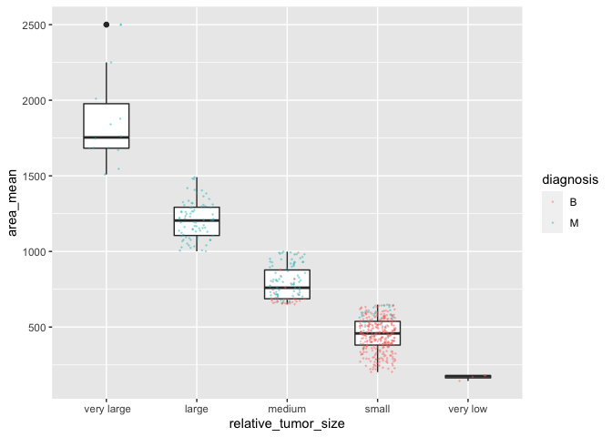
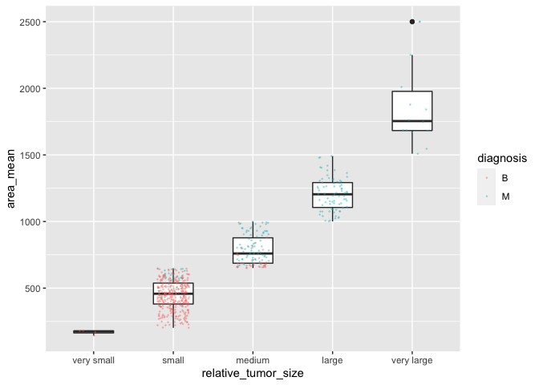
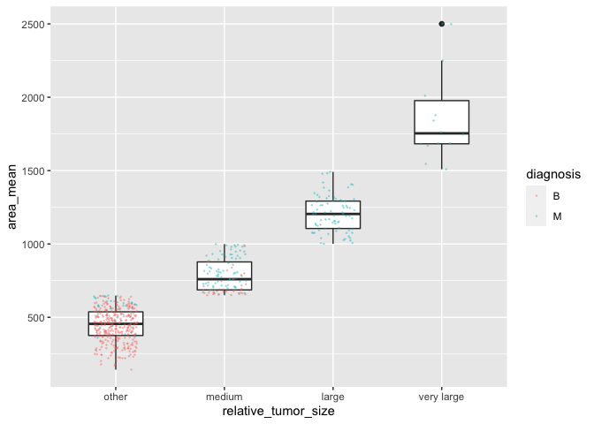
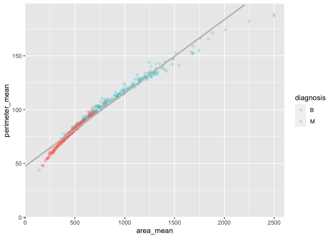

mda-Milestone-3
================

``` r
#loads needed packages to execute the code in this file and supresses startup messages
suppressPackageStartupMessages(library(datateachr)) #allows for access to the datasets in this file.
suppressPackageStartupMessages(library(tidyverse)) #loads packages needed for data visualization (ggplot2), and data manipulation (dplyr) that were used in this file.
suppressPackageStartupMessages(library(broom)) #loads package needed for modelling
```

# Research Questions:

1.  Is there a correlation between the area and perimeter of a tumor in
    regards to tumor diagnosis?
2.  Is there a correlation between the tumor’s fractal dimension and
    tumor diagnosis?

# Exercise 1

Had to make a new graph since none of my graphs in Milestone 2 had
atleast 3 factors. Below is the code to produce this original graph.

``` r
#selects cancer_sample dataset
cancer_sample %>%
  
#produces an additional variable with 5 possible categories as the observations based on area_mean  
  mutate(relative_tumor_size = case_when(area_mean < 200 ~ "very low",                                    
                                 area_mean < 650 ~ "small",
                                 area_mean < 1000 ~ "medium",
                                 area_mean < 1500 ~ "large",
                                 TRUE ~ " very large")) %>%
  
#produces a graph with relative_tumor_size on the x-axis and area_mean on the y-axis.  
  ggplot(aes(x = relative_tumor_size, y = area_mean)) +
  
#produces a boxplot and makes the width of the boxplot smaller.  
  geom_boxplot(width = 0.5) +
  
#adds the individuals data points, makes the points' transparency lower and smaller, and shifts the points horizontally while keeping the vertical position the same. Also colours the point based on tumor diagnosis.
  geom_jitter(aes(colour = diagnosis), width = 0.2, size = 0.2, alpha = 0.3)
```

<!-- -->

#### Task Number: 1

``` r
#selects cancer_sample dataset
cancer_sample %>%
  
#produces an additional variable with 5 possible categories as the observations based on area_mean  
  mutate(relative_tumor_size = factor(case_when(area_mean < 200 ~ "very small",                                                                                        area_mean < 650 ~ "small",
                                 area_mean < 1000 ~ "medium",
                                 area_mean < 1500 ~ "large",
                                 TRUE ~ "very large"),
                                 
#reorders the factors
                                 levels = c("very small", "small", "medium",  "large", "very large"))) %>%
  
#produces a graph with relative_tumor_size on the x-axis and area_mean on the y-axis.    
  ggplot(aes(x = relative_tumor_size, y = area_mean)) +
  
#produces a boxplot and makes the width of the boxplot smaller.  
  geom_boxplot(width = 0.5) +
  
#adds the individuals data points, makes the points' transparency lower and smaller, and shifts the points horizontally while keeping the vertical position the same. Also colours the point based on tumor diagnosis.  
  geom_jitter(aes(colour = diagnosis), width = 0.2, size = 0.2, alpha = 0.3)
```

<!-- -->

I chose to do this ordering of the factors because I believe when
looking at difference in sizes, it seems to be more easy on the eye when
you go from the smallest value to the largest. It is also easier to view
and see trends because its usually how this kind of measurements are
ordered. For example, if I were to remove the axis labels and factor
names, I would automatically think that in the original graph, the box
plots went from smallest to largest, which it did not.

#### Task Number: 2

``` r
#selects cancer_sample dataset
cancer_sample %>%
  
#produces an additional variable with 5 possible categories as the observations based on area_mean  
  mutate(relative_tumor_size = factor(case_when(area_mean < 200 ~ "very small",                                                                                        area_mean < 650 ~ "small",
                                 area_mean < 1000 ~ "medium",
                                 area_mean < 1500 ~ "large",
                                 TRUE ~ "very large"),
                                 levels = c("very small", "small", "medium",  "large", "very large"))) %>%
  
#groups 'very small' and 'small' into one factor called 'other'
  mutate(relative_tumor_size = fct_collapse(relative_tumor_size, 
              medium = "medium", large = "large", very_large = "very large", other = c("very small", "small"))) %>%

#produces a graph with relative_tumor_size on the x-axis and area_mean on the y-axis.  
  ggplot(aes(x = relative_tumor_size, y = area_mean)) +
  
#produces a boxplot and makes the width of the boxplot smaller.    
  geom_boxplot(width = 0.5) + 
  
#adds the individuals data points, makes the points' transparency lower and smaller, and shifts the points horizontally while keeping the vertical position the same. Also colours the point based on tumor diagnosis.    
  geom_jitter(aes(colour = diagnosis), width = 0.2, size = 0.2, alpha = 0.3) +
  
#renames the factor labels so that the 'verylarge' factor name is changed to 'very large'  
  scale_x_discrete(labels = c("other", "medium", "large", "very large"))
```

<!-- -->

I chose to do this grouping because I was mostly interested in the
medium to largest factors, but did want to remove any available data. By
doing this group it also emphasizes how there are very little numbers of
benign tumors, and they dont go past the medium factor. This provides
information on tumor diagnosis and area\_mean.

# Exercise 2

### Exercise 2.0

**Research Question:** Is there a correlation between the area and
perimeter of a tumor in regards to tumor diagnosis?

**Variable of interest:** area\_mean

### Exercise 2.1

``` r
#creates a linear model
trendline <- lm(perimeter_mean ~ area_mean, cancer_sample)

#prints the trendline object
print(trendline)
```

    ## 
    ## Call:
    ## lm(formula = perimeter_mean ~ area_mean, data = cancer_sample)
    ## 
    ## Coefficients:
    ## (Intercept)    area_mean  
    ##    47.36037      0.06812

I used the lm() function to create a linear model. The below code chunk
produces a scatterplot between area\_mean and perimeter\_mean, with a
linear regression line.

``` r
#selects cancer_sample dataset and produces a graph with area_mean on the x-axis and perimeter_mean on the y-axis.
cancer_sample %>%
  ggplot(aes(x = area_mean, y = perimeter_mean)) +
  
#plots the points for the above two variables with an alpha of 0.2 to allow for visualization of overlapping data points. A colour aesthetic was also used to show the diagnosis of each tumor.
  geom_point(aes(colour = diagnosis), alpha = 0.2) +
  
#sets the origin of the graph to 0,0 and ensures all points are included in the plot.
  expand_limits(x = 0, y = 0) +
  scale_x_continuous(expand = c(0, 0), limits = c(0, max(cancer_sample$area_mean)+100)) + 
  scale_y_continuous(expand = c(0, 0), limits = c(0, max(cancer_sample$perimeter_mean)+10)) +

#adds a linear trend line
  stat_smooth(method = 'lm', colour = "grey", se = FALSE, fullrange=TRUE) 
```

    ## `geom_smooth()` using formula 'y ~ x'

    ## Warning: Removed 12 rows containing missing values (geom_smooth).

<!-- -->

### Exercise 2.2

I decided to look at the P value so I used the tidy() function which
provides the P value in column 5 of the generated tibble. I was second
guessing myself because I’ve never seen a P value of 0, so to double
check this I ran a Welch Two Sample t-test using the t.test() function.
The results from t test are seen in the R console generated below and it
shows that the p value is really small so tidy provided it as 0, meaning
the results are very statistically significant.

``` r
#provides data such as estimate, std.error, a statistic, and p.value
tidy(trendline)
```

    ## # A tibble: 2 × 5
    ##   term        estimate std.error statistic p.value
    ##   <chr>          <dbl>     <dbl>     <dbl>   <dbl>
    ## 1 (Intercept)  47.4     0.353         134.       0
    ## 2 area_mean     0.0681  0.000475      143.       0

``` r
#produces a Welch Two Sample t-test, provides statistical data including P value
x <- cancer_sample$area_mean
y <- cancer_sample$perimeter_mean
t.test(x, y)
```

    ## 
    ##  Welch Two Sample t-test
    ## 
    ## data:  x and y
    ## t = 38.066, df = 573.42, p-value < 2.2e-16
    ## alternative hypothesis: true difference in means is not equal to 0
    ## 95 percent confidence interval:
    ##  533.8746 591.9656
    ## sample estimates:
    ## mean of x mean of y 
    ## 654.88910  91.96903

# Exercise 3

### Exercise 3.1

##### Summary table from Milestone 2

``` r
#selects cancer_sample dataset
(factored_mean_data <- cancer_sample %>%
  
#groups data based on the diagnosis variable
  group_by(diagnosis) %>%
  
#produces an additional variable with 3 possible categories as the observations based on area_mean
  mutate(relative_tumor_size = case_when(area_mean < 650 ~ "small",
                                 area_mean < 1000 ~ "medium",
                                 TRUE ~ "large")) %>%
  
#only provides a tibble with the desired varibles
  select(ID,diagnosis,area_mean,relative_tumor_size,radius_mean:perimeter_mean,smoothness_mean:fractal_dimension_mean))
```

    ## # A tibble: 569 × 13
    ## # Groups:   diagnosis [2]
    ##          ID diagnosis area_mean relative_tumor_size radius_mean texture_mean
    ##       <dbl> <chr>         <dbl> <chr>                     <dbl>        <dbl>
    ##  1   842302 M             1001  large                      18.0         10.4
    ##  2   842517 M             1326  large                      20.6         17.8
    ##  3 84300903 M             1203  large                      19.7         21.2
    ##  4 84348301 M              386. small                      11.4         20.4
    ##  5 84358402 M             1297  large                      20.3         14.3
    ##  6   843786 M              477. small                      12.4         15.7
    ##  7   844359 M             1040  large                      18.2         20.0
    ##  8 84458202 M              578. small                      13.7         20.8
    ##  9   844981 M              520. small                      13           21.8
    ## 10 84501001 M              476. small                      12.5         24.0
    ## # … with 559 more rows, and 7 more variables: perimeter_mean <dbl>,
    ## #   smoothness_mean <dbl>, compactness_mean <dbl>, concavity_mean <dbl>,
    ## #   concave_points_mean <dbl>, symmetry_mean <dbl>,
    ## #   fractal_dimension_mean <dbl>

##### Produce a .csv file

``` r
#writes the tibble 'factored_mean_data' intro a .csv file in the folder named 'output'
write_csv(factored_mean_data, here::here("~/Desktop/STAT_545/STAT_545A/mda-Kyle-Amaral/output", "fractored_mean_data.csv"))
```

### Exercise 3.2

The model object from Exercise 2 is named ‘trendline’

``` r
#writes the object to an R binary file (RDS file for this case)
saveRDS(trendline, here::here("~/Desktop/STAT_545/STAT_545A/mda-Kyle-Amaral/output", "trendline.RDS"))

#loads this RDS file
(readRDS("~/Desktop/STAT_545/STAT_545A/mda-Kyle-Amaral/output/trendline.RDS"))
```

    ## 
    ## Call:
    ## lm(formula = perimeter_mean ~ area_mean, data = cancer_sample)
    ## 
    ## Coefficients:
    ## (Intercept)    area_mean  
    ##    47.36037      0.06812

# Additional Comments

My personal branch still doesn’t work as it doesn’t allow for pull
requests to be made between the personal branch and main branch. I had
to complete this whole Milestone on the main branch due to this issue. I
continue to get an error and its not related to doing pull and pushes
from Rstudio because both branches are up to date when I do so.
